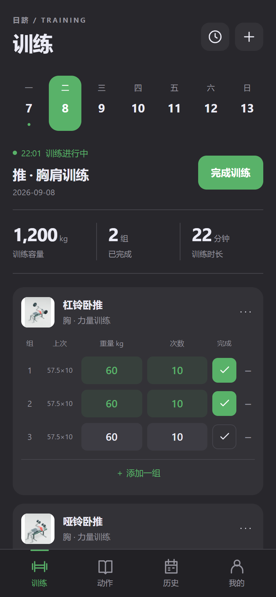
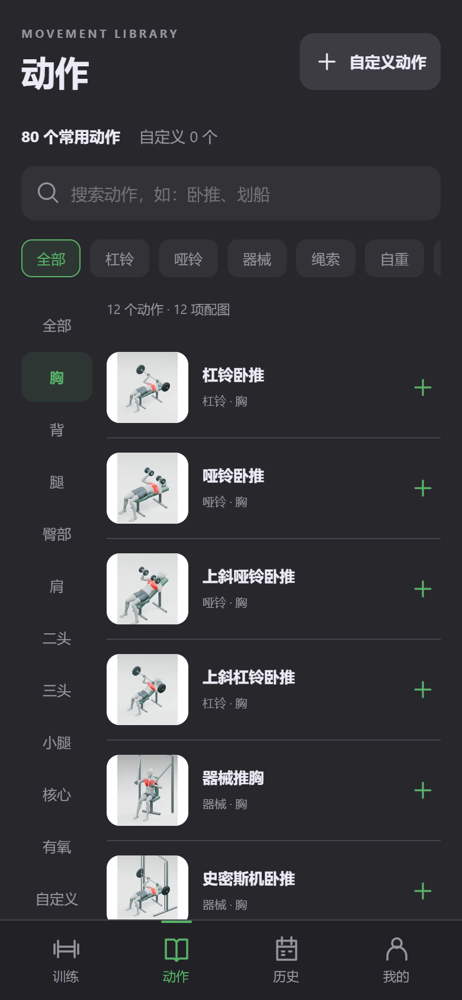
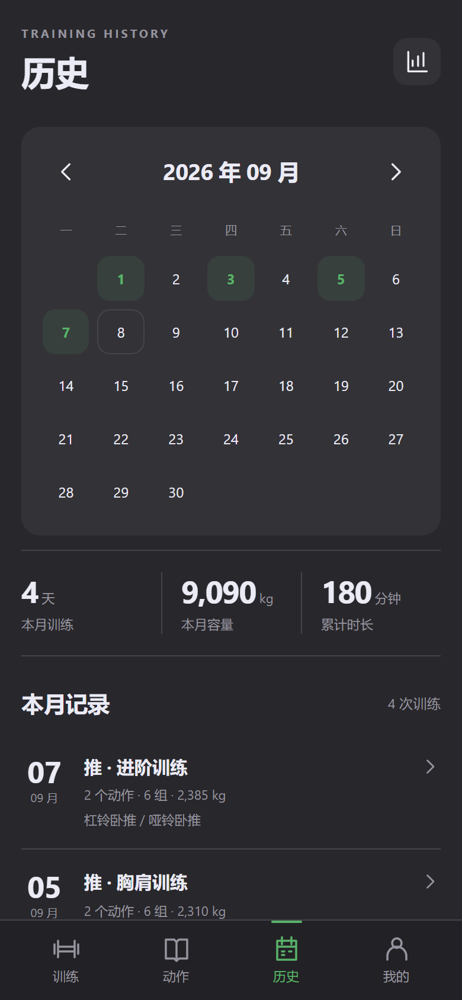
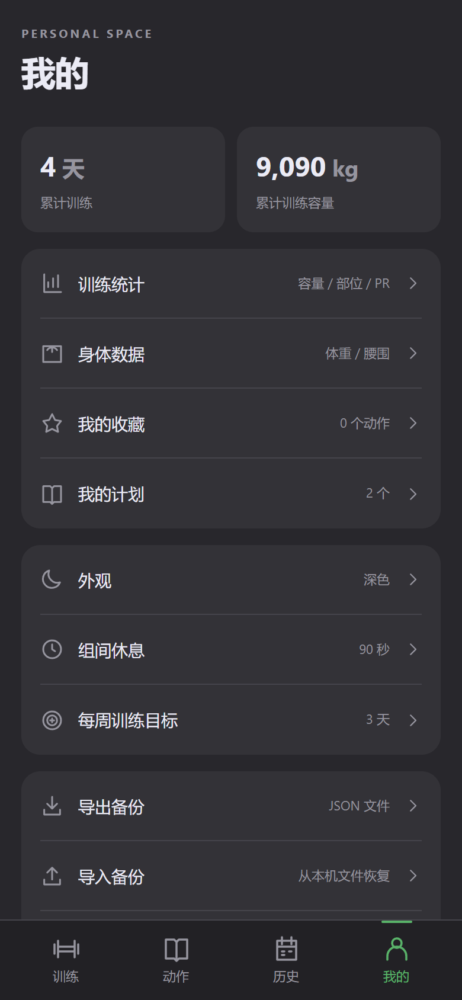

<p align="center"></p>

<p align="center">
  <a href="https://chenzhiyong1994.github.io/riji/">项目主页</a> ·
  <a href="https://github.com/chenzhiyong1994/riji/raw/refs/heads/main/downloads/Riji-1.1.3.apk">下载 Android 安装包</a> ·
  <a href="https://chenzhiyong1994.github.io/riji/downloads/Riji-1.1.3-ios-unsigned.ipa">下载 iOS IPA（需签名）</a> ·
  <a href="CHANGELOG.md">版本说明</a> ·
  <a href="CONTRIBUTING.md">参与开发</a>
</p>

# 日跻 · 离线训练记录

**如月之恒，如日之升**

日跻（rì jī）是一个开源 Android / iOS 训练记录 App。打开就能记下一组训练，重量、次数、历史与个人计划都保存在本机。无需账号，无广告，无分析统计 SDK，运行时不联网。

“日跻”取自《诗经·商颂·长发》“圣敬日跻”，寄意于持续训练、逐步精进。Slogan 出自《诗经·小雅·天保》。

## 下载与安装

**[下载日跻 1.1.3 APK](https://github.com/chenzhiyong1994/riji/raw/refs/heads/main/downloads/Riji-1.1.3.apk)** · Android 8.0+ · 57.8 MiB · [SHA-256 校验](downloads/SHA256SUMS.txt)

下载后打开 APK，按系统提示允许当前下载工具安装应用。已有同签名日跻/迹练的用户可以覆盖更新；升级前建议导出备份，不要先卸载。包名保持 `local.jilian.app`，存储与旧版 JSON 备份继续兼容。

**[下载日跻 1.1.3 iOS IPA](https://chenzhiyong1994.github.io/riji/downloads/Riji-1.1.3-ios-unsigned.ipa)** · iOS / iPadOS 16.0+ · [安装说明](docs/ios.md) · [SHA-256 校验](downloads/SHA256SUMS.txt)

**IPA 未签名，需使用自己的账号和工具签名后安装，不能在 Safari 中下载后直接打开。** 也可在 Mac 上使用 Xcode 构建并安装；不是 App Store / TestFlight 版本。更新时沿用相同签名身份与 Bundle Identifier，先导出备份，不要卸载。Android 与 iOS 的 JSON 备份互通。

## 让记录跟上训练

| 训练                                                                          | 动作                                                                              | 历史                                                                           | 我的                                                                           |
| ----------------------------------------------------------------------------- | --------------------------------------------------------------------------------- | ------------------------------------------------------------------------------ | ------------------------------------------------------------------------------ |
|  |  |  |  |

以上截图使用虚构演示数据，来自 App 界面的隔离浏览器预览。

- **逐组记录**：重量、次数、计时，普通组 / 热身组 / 递减组，组间休息计时。进行中的训练自动保存，重新打开可继续。
- **训练模板与个人计划**：8 个模板覆盖不同经验、目标和器械，共 16 份计划。添加为自己的计划后，可修改动作顺序、组数、次数或秒数、休息时间及说明。见 [使用说明](docs/training-templates.md)。
- **80 个常用动作**：按部位、器械和名称筛选，收藏常练动作，也能创建、修改、删除和恢复自定义动作。
- **动作演示与要点**：80 份离线 3D 动画配套发力重点、动作步骤及常见误区；播放控制位于动画内，支持后台暂停和减少动态效果。见 [动作说明](docs/exercise-guidance.md)。
- **回看进步**：训练日历、容量、时长、部位分布和动作 PR；可选记录体重、腰围。
- **自己保管数据**：通过系统文件选择器导出 JSON 备份，或导入兼容备份；提供共用绿色主题色的深色与浅色主题。

## 开始使用

1. 在「训练」新建训练，或浏览「训练模板」，添加到「我的计划」后编辑并开始。
2. 添加动作，记录每组重量与次数，完成一组后勾选。
3. 点击「完成训练」保存。未勾选的组不会计入历史或训练容量。
4. 在「历史」回看记录，在「我的 → 训练统计」查看进展。
5. 定期在「我的 → 导出备份」保存 JSON。导入会先显示数据概览，经确认后替换当前数据。

## 离线与隐私

页面、动作和媒体由安装包本地加载，外部请求和导航被原生宿主阻止。Android 不声明网络、位置、通讯录、相机或全盘存储读取权限，训练记录通过 SharedPreferences 原子保存，系统云备份与设备迁移备份关闭。iOS 使用 Swift / WKWebView，训练数据原子保存至私有文件并排除系统备份，通过系统文件选择器主动导入导出。

**没有云同步；卸载会删除本地数据。** 请自行保管导出的备份。详情见 [隐私说明](docs/privacy.md)。

## 开发

界面采用原生 HTML / CSS / JavaScript；Android Java 与 iOS Swift 宿主提供受限 WebView、本地存储和系统文件选择器。没有前端框架或运行时在线依赖。

```sh
npm ci
npm run dev
```

访问 `http://127.0.0.1:8766`。测试使用 `npm test` 和 `npx playwright test`；Android 构建使用 Java 17、SDK 36、Gradle Wrapper。详细步骤见 [开发与贡献](CONTRIBUTING.md)。

iOS 在 Mac 上打开 `ios/Riji.xcodeproj`，或运行 `bash scripts/test-ios.sh`、`bash scripts/build-ios.sh`。GitHub Actions 自动运行原生模拟器测试并构建未签名真机 IPA，详情见 [iOS 文档](docs/ios.md)。

## 当前边界

当前在 Android 16 模拟器上验证，实体手机及所有旧系统仍需补充测试；请保持 Android System WebView 更新。组间计时器回到前台后会按实际时间恢复，暂不提供后台或锁屏提醒音。

iOS 已通过原生模拟器训练、存储与备份集成验证；实体 iPhone / iPad、个人签名安装、真实文件提供商和最低 iOS 16 系统仍待验证。

**动作动画仍是待复核版本。** 部分关节、手腕、握持、器械接触和肌群位置需要继续修正；它们用于视觉参考，不应作为规范动作教学。遇到问题欢迎提供动作名称、问题位置与截图，见 [动作制作说明](art/exercise-library/README.md)。

## 开源许可与来源

原创代码采用 [MIT License](LICENSE)。素材许可与来源记录见 [THIRD_PARTY_NOTICES.md](THIRD_PARTY_NOTICES.md)。
