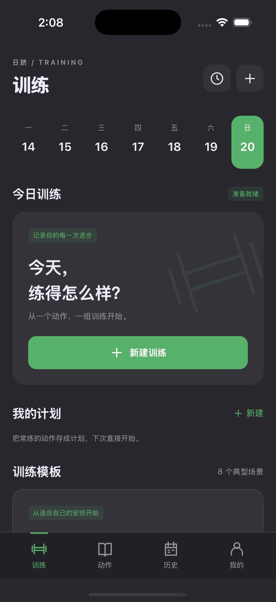

# iOS 1.1.3 验证记录

日期：2026-09-20。构建源码：`74e96a17d787144c44ca048876783312dab361cf`。

## 自动化验证

[iOS 构建与测试](https://github.com/chenzhiyong1994/riji/actions/runs/35515200643) 全部通过：GitHub macOS 15、Xcode 16.4、iPhone 16 Pro / iOS 18.5 模拟器，随后执行 ARM64 Release 真机构建。

4 项原生集成测试使用实际 WKWebView 和隔离数据目录，覆盖：

- 新建训练、记录 60 × 10、重建宿主后继续、完成后容量为 600。
- 原生文件读取、应用内确认导入及备份恢复；系统导入和导出选择器正常展示。
- 非法备份与写入失败不会使界面冒充保存成功；超限文件被拒绝，既有数据保留。
- 离线动态 WebP 解码、暂停切换静态封面及阻止外部导航。

[共享功能与 Android 检查](https://github.com/chenzhiyong1994/riji/actions/runs/35515200671) 通过：19 项 Node 测试、18 项 Chromium 测试、Android Release 构建与 Lint。

## 发布包与页面

`Riji-1.1.3-ios-unsigned.ipa` 是 ARM64 / iPhoneOS 包，版本 `1.1.3` / build `1`，最低系统版本 `16.0`。校验器确认没有签名目录和描述文件，包内 252 个共享资源以及 JavaScript 桥接均与构建源码逐字节一致。

安装包大小为 60,481,099 字节（57.7 MiB）。从 Actions 下载的完整文件已在本地按 Git 原始字节重新核对，并解包扫描；SHA-256：`4782cefa25c46071994bd45254e12c14ba0aa1f640acc4e26b50e46cb28a31ad`。

模拟器全新启动截图已检查，未使用用户训练数据：

双平台介绍页在 1440px、390px 和 320px 下无横向溢出，四页预览切换正常；下载入口附有个人签名要求和安装说明。

## 实际边界

以上测试不等于实体设备验收。iPhone / iPad 真机、个人签名与续签、系统文件提供商的实际文件选择和导出、最低 iOS 16 系统仍需补充验证。备份测试调用真实原生文件读取与回调，但没有在云端自动操作用户的 iCloud Drive。80 份动画姿势仍待复核。
